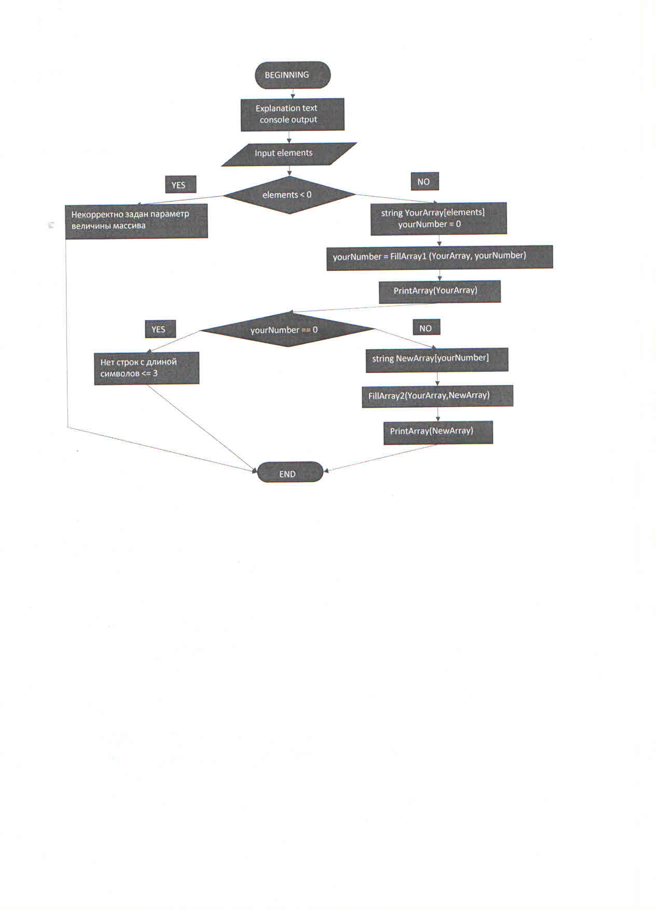

# Текстовое описание алгоритма
## Описание задачи
### Написать программу, которая из имеющегося массива строк формирует массив из строк, длина которых меньше, либо равна 3 символа. Первоначальный массив вводится пользователем с клавиатуры. 
## Этапы решения задачи и их содержание
### 1. Начальные установки
1. Вывести на дисплей пояснительный текст для пользователя
2. Пользователь вводит желаемое кол-во элементов(строк) в массиве
### 2. Проверка корректности ввода
1. Если значение, введённое пользователем, меньше 0, выдаётся сообщение об ошибке ввода и программа завершает свою работу
### 3. Ввод строк исходного массива пользователем, вывод его на дисплей, подсчёт числа строк, удовлетворяющих необходимому условию
1. Резервируется память для исходного массива в кол-ве элементов, указанным пользователем
2. Инициализируется счётчик числа элементов (строк), удовлетворяющих заданному условию
3. Вызываем метод, который позволяет пользователю осуществить ввод элементов (строк) массива
4. Определяем число строк, соответствующих заданному условию и сохраняем это значение в соответствующей переменной
5. Выводим на дисплей исходный массив
### 4. Проверка значения числа строк
1. Если это значение равно 0, то выдаётся сообщение, что строк, удовлетворяющих условию, нет в массиве
2. Если значение больше 0, переходим к пункту 5
### 5. Заполнение нового массива строками, удовлетворяющими заданному условию, вывод результирующего массива на печать
1. Резервируем память под новый массив в кол-ве элементов, соответствующих значению переменной, определяющей число нужных строк
2. Вызываем метод, который позволяет переписать нужные строки из первого массива в результирующий
3. Выводим на дисплей результирующий массив
### 6. Завершение алгоритма

## Блок-схема алгоритма

[блок-схема в Excel](Flowchart.xlsx)

